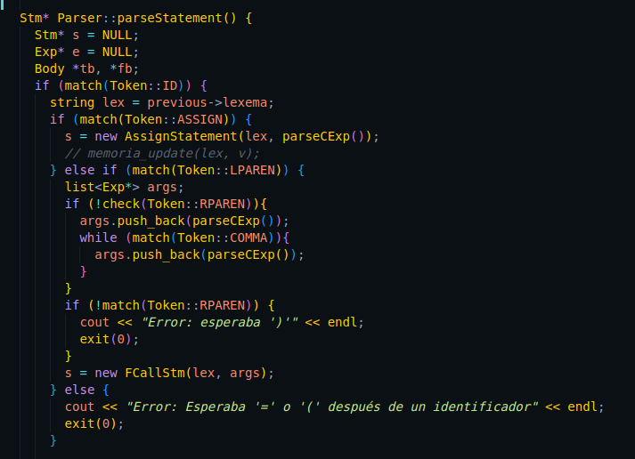
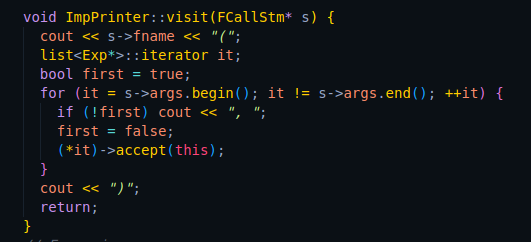
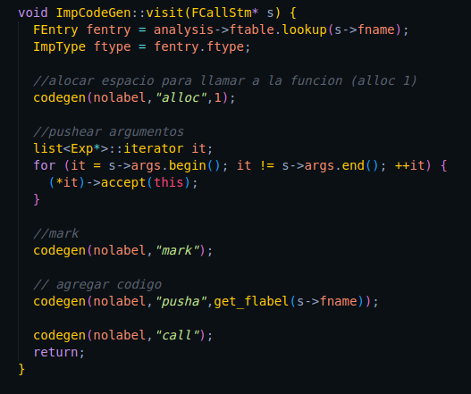

# Proyecto Parte II - Compiladores

## Integrantes


| <a href="https://github.com/anamariaaccilio" target="_blank">**Ana Maria Accilio Villanueva**</a> | <a href="https://github.com/YaredRiveros" target="_blank">**Yared Riveros Rodriguez**</a> | <a href="https://github.com/Angel-Utec" target="_blank">**Angel Ulises Tito Berrocal**</a> |
| :----------------------------------------------------------------------------------------------: | :----------------------------------------------------------------------------------: | :-----------------------------------------------------------------------------------------: |
|  |  |  |


<a name="readme-top"></a>
<details open>
  <summary><h2>Tabla de contenidos:<h2></summary>
  <ul>
    <li><a href="#Uso 🖊">Uso 🖊</a></li>
    <li><a href="#Ítem 1">Ítem 1</a></li>
    <li><a href="#Ítem 2">Ítem 2</a></li>
    <li><a href="#Ítem 3">Ítem 3</a></li>
</details>

<hr>

##  Uso 🖊

- Ejecutar:
```
g++ imp_codegen.cpp imp.cpp imp_interpreter.cpp imp_parser.cpp imp_printer.cpp imp_typechecker.cpp imp_type.cpp imp_value.cpp test_imp_fun.cpp -o imp

```
- Ejecutar ejemplos:

```
./imp ejemplo.imp
```

## Item 1: El TypeChecker y Codegen

### Typechecker por función

En este apartado describiremos los cambios realizados para calcular el espacio requerido para almacenar las variables locales y la altura máxima de la pila, que serán necesarios para las instrucciones de pila "alloc" y "enter" respectivamente.

Primero, en imp_typechecker.hh creamos los siguientes atributos:
- int nivel: utilizado para determinar si estamos o no analizando una declaración de variable global.
- int var_globales: necesario para contar el número de variables globales.

Segundo, en el mismo archivo creamos los métodos:
- sp_decr: decrementa el SP
- sp_incr: incrementa el SP
- dir_decr: decrementa la dirección de memoria actual
- dir_incr: incrementa la dirección de memoria actual


Tercero, para realizar el conteo de variables globales se realiza en ImpTypeChecker::visit(VarDec* vd) verificando si el "nivel==1":


Cuarto, para contar el número de variables locales por función modificamos ImpTypeChecker::visit(FunDecList* s) de la siguiente manera:


Por último, al final del programa, el máximo tamaño de la pila para una función se calcula como #variables_locales + #variables_globales y se guarda en fentry.max_stack. Por su parte, el espacio requerido para las variables locales se guarda en fentry.mem_locals:


### Direcciones de variables

#### Diferenciando variables locales de globales

Partimos del método ImpCodeGen::visit(Program* p), en donde se inicializa current_dir=1 y se clasifican las variables como globales o locales utilizando la variable process_global.

Toda declaración de variables (tanto locales como globales) y su respectiva de asignación de dirección de memoria se realiza en el método ImpCodeGen::visit(VarDec* vd) de la siguiente manera:


Para reiniciar el valor de current_dir cada vez que acabamos de recorrer una función, se le asigna a current_dir=1 en ImpCodeGen::visit(FunDec* fd):


De esta manera, todas las declaraciones de variables para cada función empiezan en la dirección de memoria 1. La forma en la que se distinguirá el acceso a memoria a direcciones de variables locales o globales será mediante el uso de store o storer según sea el caso:


#### Dirección de parámetros de una función

Como vimos en clase de teoría, los parámetros se enumeran desde i=1 hasta n, siendo n el número de parámetros. La convención a la que se llegó es que la dirección en la que se debe guardar el parámetro i es i-(#parámetros+3). Este cálculo se realizó en ImpCodeGen::visit(FunDec* fd):


#### Dirección del valor de retorno

Otra convención que se hizo en el curso es que el valor de retorno de una función se almacena siempre en -1*(#parámetros+3). Este cálculo se hizo también en ImpCodeGen::visit(FunDec* fd):


### Tests

Para verificar la correctitud, comparamos nuestros .sm generados con los .sm que nos fueron brindados como ejemplo. Comparamos:

- ejemplo_main.imp.sm con ejemplo_main.imp_sol.sm
- ejemplo_suma.imp.sm con ejemplo_suma.imp_sol.sm

, los cuales coincidieron al 100%.

En el caso de funciones recursivas como ejemplo_sumarec.imp, no logramos calcular correctamente el valor de enter, pero el resto de líneas coinciden con las soluciones que nos brindaron.


## Item 2: Implementar FCallStm

Para el FCallStm consideramos la sintaxis del FCallExp:


```cpp
FCallStm ::= id “(“ [ArgList] “)”
ArgList ::= CExp (“,” CExp)*
```

La sentencia `FCallStm` nos permitirá llamar a funciones respecto a su tipo de retorno. Implica que ajustemos el parser, typechecker y el codegen, de esa forma nos aseguramos que las llamadas a funciones como sentencias sean correctamente validadas.

### Cambios realizados:

### 1. Parser

En el parser, se introdujeron nuevas reglas gramaticales para reconocer la sintaxis de `FCallStm` y `ArgList`, que son esenciales para la correcta interpretación de llamadas a funciones como sentencias en el código fuente.


<div>
<p style = 'text-align:center;'>

</p>
</div>

**Explicación:**

- **Id del Token:** Se utiliza `match(Token::ID)` para identificar un id, seguido de `match(Token::LPAREN)` para determinar si es una llamada a función.

- **Parseo de Args:** Se maneja la lista de argumentos dentro de los paréntesis `(...)` mediante un bucle que utiliza `parseCExp()` para parsear cada expresión.

- **FCallStm:** Cuando se detecta una llamada a función como sentencia, se instancia un objeto `FCallStm` con el nombre de la función y la lista de argumentos parseados.


La implementación de FCallStm en el parser del compilador IMP-FUN ha mejorado significativamente la flexibilidad y funcionalidad del lenguaje, permitiendo la ejecución de funciones como sentencias


### 2. Typechecker

El type checker incluye una función visit dedicada para verificar las llamadas a FCallStm.

<div>
<p style = 'text-align:center;'>

</p>
</div>

**Explicación:**

- **Verificación de Existencia y Tipo de la Función:**

    - Se utiliza env.check(s->fname) para verificar si la función `s->fname` está definida en el entorno de símbolos `(env)`.

    - `env.lookup(s->fname)` devuelve el tipo (ImpType) asociado con `s->fname` en el entorno.
    - Si el tipo encontrado (funtype.ttype) no es ImpType::FUN, se informa que el símbolo no corresponde a una función válida.

- **Verificación de Número y Tipos de Argumentos:**

    - Se compara el número de argumentos recibidos (s->args.size()) con el número esperado `(num_fun_args)`.
    - Si no coinciden, se indica un error de cantidad de argumentos.

- **Verificación de Tipos de Argumentos:**

    - Se itera sobre la lista de argumentos `(s->args)` y se utiliza `(*it)->accept(this)` para obtener y validar el tipo de cada argumento.
    - Se compara el tipo obtenido con el tipo esperado (funtype.types[i]).

- **Manejo del Nivel de Profundidad de Pila:**

    - `sp_incr(1)` se utiliza para incrementar el contador de profundidad de la pila. Esto puede ser relevante para el manejo de la pila de ejecución durante la generación de código.

La función visit para FCallStm en el type checker asegura que las llamadas a funciones estén correctamente tipadas y que los argumentos coincidan con los parámetros esperados. 


### 3. Printer

Para imprimir una representación textual de una sentencia `FCallStm`. Esta función es parte del proceso de impresión o generación de código en forma legible.

<div>
<p style = 'text-align:center;'>

</p>
</div>

**Explicación:**

La función `visit` de `ImpPrinter` para `FCallStm` realiza las siguientes acciones:

   - Itera sobre la lista de argumentos (`s->args`) que se pasan a la función.
   - Para cada argumento, verifica si es el primero (`first`). Si no es el primero, imprime una coma y un espacio antes de imprimir el argumento.
   - Invoca `(*it)->accept(this)` para cada argumento, lo que permite que el argumento se imprima correctamente según su tipo (puede ser una expresión compleja o una variable).

3. **Cierre de la Llamada a la Función:**
   ```cpp
   cout << ")";
   ```
   - Imprime un paréntesis de cierre para indicar el final de la lista de argumentos de la función.

4. **Retorno de la Función:**
   ```cpp
   return;
   ```
   - Finaliza la función `visit`.


La función `visit(FCallStm* s)` en `ImpPrinter` es crucial para la fase de generación de código o impresión en un compilador o intérprete. Su objetivo principal es producir una representación textual precisa de una llamada a función, asegurando que todos los argumentos se impriman correctamente y en el orden correcto.


### 4. Codegen

La función `visit` de `ImpCodeGen` para `FCallStm` realiza lo siguiente:


<div>
<p style = 'text-align:center;'>

</p>
</div>

**Explicación:**


- **Tabla de Símbolos:**

   ```cpp
   FEntry fentry = analysis->ftable.lookup(s->fname);
   ImpType ftype = fentry.ftype;
   ```
   - Utiliza la tabla de símbolos (`ftable`) para buscar la entrada (`fentry`) correspondiente al nombre de la función (`s->fname`). Obtiene el tipo de la función (`ftype`) desde la entrada encontrada. Esto es crucial para conocer la firma y los detalles de la función, como los tipos de los argumentos y el tipo de retorno.

- **Espacio para Llamar a la Función:**
   ```cpp
   codegen(nolabel,"alloc",1);
   ```
   - Genera una instrucción de código (`alloc`) para reservar espacio en la pila de ejecución. En este caso, se reserva espacio para los parámetros y las variables locales.


- **Llamar a la Función:**
   ```cpp
   codegen(nolabel,"pusha",get_flabel(s->fname));
   codegen(nolabel,"call");
   ```
   - Genera código para empujar la dirección de la función (`get_flabel(s->fname)`) a la pila de llamadas (`pusha`).
   - Luego, genera una instrucción de llamada (`call`) para transferir el control de ejecución al inicio de la función identificada por `s->fname`.


Gestionar la pila de ejecución, asegurar que los argumentos se pasen correctamente y transferir el control de manera efectiva al inicio de la función llamada.
 

### Test 

Todos los test compilan adecuadamente y con buena presición en los resultados.
